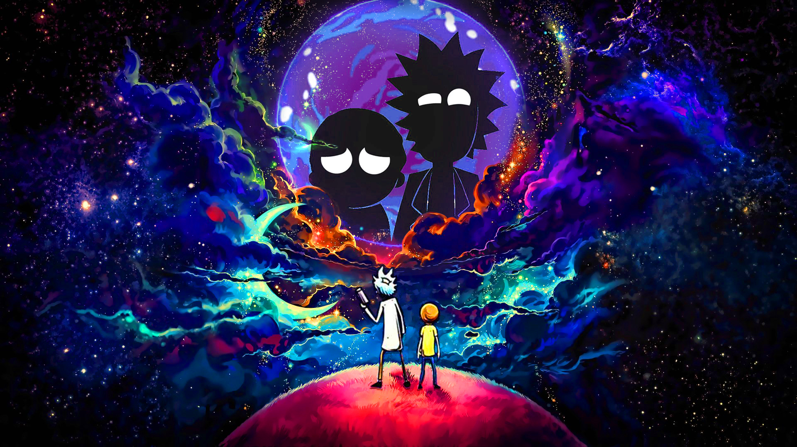

# **💪 HW1 | DBMS - Integration**

## **🕒 DURACIÓN ESTIMADA**

XX minutos

 

---

## **💻 RICK AND MORTY APP 💻**

## **📝 INTRODUCCIÓN**

Bienvenido a la primera homework del Módulo 4. En esta oportunidad te desafiaremos a diseñar un **`modelo Entidad/Relación`**.

 

---

## **📋 INSTRUCCIONES**

### **👩‍💻 EJERCICIO 01 | Diagrama**

Diseñar un **`modelo Entidad/Relación`** que converja todas aquellas entidades que creas presente en tu proyecto de **`Rick&Morty`**.

Puedes utilizar cualquier plataforma para realizar el diseño (incluso lapiz y papel), pero te recomendamos que utilices [**LUCIDCHART**](https://www.lucidchart.com/) que tiene potentes recursos para este tipo de tareas.

---

 

